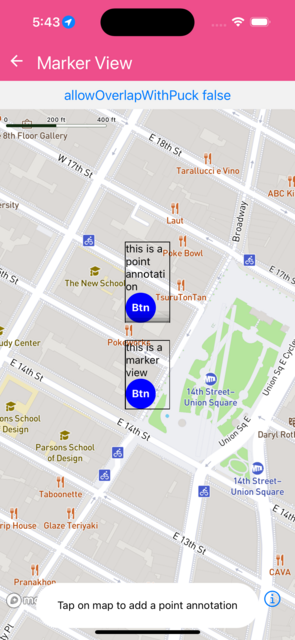

Shows marker view and poitn annotations


```jsx
import React from 'react';
import { View, Text, TouchableOpacity } from 'react-native';
import Mapbox from '@rnmapbox/maps';

import Bubble from '../common/Bubble';

const styles = {
  touchableContainer: { borderColor: 'black', borderWidth: 1.0, width: 60 },
  touchable: {
    backgroundColor: 'blue',
    width: 40,
    height: 40,
    borderRadius: 20,
    alignItems: 'center',
    justifyContent: 'center',
  },
  touchableText: {
    color: 'white',
    fontWeight: 'bold',
  },
  matchParent: { flex: 1 },
};

const AnnotationContent = ({ title }) => (
  <View style={styles.touchableContainer}>
    <Text>{title}</Text>
    <TouchableOpacity style={styles.touchable}>
      <Text style={styles.touchableText}>Btn</Text>
    </TouchableOpacity>
  </View>
);

class ShowMarkerView extends React.Component {
  constructor(props) {
    super(props);

    this.state = {
      backgroundColor: 'blue',
      coordinates: [
        [-73.99155, 40.73581],
        [-73.99155, 40.73681],
      ],
    };
  }

  onPress(e) {
    this.setState({
      coordinates: [...this.state.coordinates, e.geometry.coordinates],
    });
  }

  render() {
    return (
      <>
        <Mapbox.MapView
          ref={(c) => (this._map = c)}
          onPress={(e) => this.onPress(e)}
          onDidFinishLoadingMap={this.onDidFinishLoadingMap}
          style={styles.matchParent}
        >
          <Mapbox.Camera
            defaultSettings={{
              zoomLevel: 16,
              centerCoordinate: this.state.coordinates[0],
            }}
          />

          <Mapbox.PointAnnotation
            coordinate={this.state.coordinates[1]}
            id="pt-ann"
          >
            <AnnotationContent title={'this is a point annotation'} />
          </Mapbox.PointAnnotation>

          <Mapbox.MarkerView coordinate={this.state.coordinates[0]}>
            <AnnotationContent title={'this is a marker view'} />
          </Mapbox.MarkerView>

          {this.state.coordinates.slice(2).map((coordinate, index) => (
            <Mapbox.PointAnnotation
              coordinate={coordinate}
              id={`pt-ann-${index}`}
              key={`pt-ann-${index}`}
            >
              <AnnotationContent title={'this is a point annotation'} />
            </Mapbox.PointAnnotation>
          ))}
        </Mapbox.MapView>

        <Bubble>
          <Text>Click to add a point annotation</Text>
        </Bubble>
      </>
    );
  }
}

export default ShowMarkerView;


```

}

