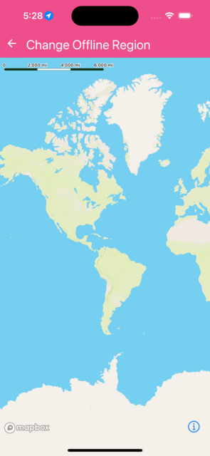

Creates offline pack and montiors them


```jsx
import React from 'react';
import {
  Alert,
  Text,
  View,
  Button,
  TouchableOpacity,
  Dimensions,
  StyleSheet,
} from 'react-native';
import Mapbox, { offlineManager, MapView, Camera } from '@rnmapbox/maps';
import geoViewport from '@mapbox/geo-viewport';

import sheet from '../../styles/sheet';
import Bubble from '../common/Bubble';

const CENTER_COORD = [-73.970895, 40.723279];
const MAPBOX_VECTOR_TILE_SIZE = 512;

const styles = StyleSheet.create({
  bubble: { flex: 1 },
  button: {
    alignItems: 'center',
    backgroundColor: 'blue',
    borderRadius: 3,
    flex: 0.4,
    justifyContent: 'center',
    padding: 8,
  },
  buttonCnt: {
    alignItems: 'center',
    flexDirection: 'row',
    justifyContent: 'space-between',
  },
  buttonTxt: {
    color: 'white',
  },
});

class CreateOfflineRegion extends React.Component {
  constructor(props) {
    super(props);

    this.state = {
      name: `test-${Date.now()}`,
      offlineRegion: null,
      offlineRegionStatus: null,
    };

    this.onDownloadProgress = this.onDownloadProgress.bind(this);
    this.errorListener = this.errorListener.bind(this);
    this.onDidFinishLoadingStyle = this.onDidFinishLoadingStyle.bind(this);

    this.onResume = this.onResume.bind(this);
    this.onPause = this.onPause.bind(this);
    this.onStatusRequest = this.onStatusRequest.bind(this);
    this.onCreate = this.onCreate.bind(this);

    this.options = {};
  }

  componentWillUnmount() {
    // avoid setState warnings if we back out before we finishing downloading
    offlineManager.deletePack(this.state.name);
    offlineManager.unsubscribe('test');
  }

  async onDidFinishLoadingStyle() {
    const { width, height } = Dimensions.get('window');
    const bounds = geoViewport.bounds(
      CENTER_COORD,
      12,
      [width, height],
      MAPBOX_VECTOR_TILE_SIZE,
    );

    this.options = {
      name: this.state.name,
      styleURL: Mapbox.StyleURL.Street,
      bounds: [
        [bounds[0], bounds[1]],
        [bounds[2], bounds[3]],
      ],
      minZoom: 10,
      maxZoom: 20,
    };
  }

  errorListener(offlineRegion, error) {
    console.log('Error:', error);
  }

  onDownloadProgress(offlineRegion, offlineRegionStatus) {
    this.setState({
      name: offlineRegion.name,
      offlineRegion,
      offlineRegionStatus,
    });
  }

  onCreate() {
    // start download
    offlineManager.createPack(
      this.options,
      this.onDownloadProgress,
      this.errorListener,
    );
  }

  onResume() {
    if (this.state.offlineRegion) {
      this.state.offlineRegion.resume();
    }
  }

  onPause() {
    if (this.state.offlineRegion) {
      this.state.offlineRegion.pause();
    }
  }

  async onStatusRequest() {
    if (this.state.offlineRegion) {
      const offlineRegionStatus = await this.state.offlineRegion.status();
      Alert.alert('Get Status', JSON.stringify(offlineRegionStatus, null, 2));
    }
  }

  _formatPercent() {
    if (!this.state.offlineRegionStatus) {
      return '0%';
    }
    return Math.round(this.state.offlineRegionStatus.percentage / 10) / 10;
  }

  _getRegionDownloadState(downloadState) {
    switch (downloadState) {
      case Mapbox.OfflinePackDownloadState.Active:
        return 'Active';
      case Mapbox.OfflinePackDownloadState.Complete:
        return 'Complete';
      default:
        return 'Inactive';
    }
  }

  render() {
    const { offlineRegionStatus } = this.state;

    return (
      <>
        <MapView
          ref={(c) => {
            this._map = c;
          }}
          onPress={this.onPress}
          onDidFinishLoadingMap={this.onDidFinishLoadingStyle}
          style={sheet.matchParent}
        >
          <Camera zoomLevel={10} centerCoordinate={CENTER_COORD} />
        </MapView>

        {offlineRegionStatus !== null ? (
          <Bubble>
            <View style={styles.bubble}>
              <Text>
                Download State:{' '}
                {this._getRegionDownloadState(offlineRegionStatus.state)}
              </Text>
              <Text>Download Percent: {offlineRegionStatus.percentage}</Text>
              <Text>
                Completed Resource Count:{' '}
                {offlineRegionStatus.completedResourceCount}
              </Text>
              <Text>
                Completed Resource Size:{' '}
                {offlineRegionStatus.completedResourceSize}
              </Text>
              <Text>
                Completed Tile Count: {offlineRegionStatus.completedTileCount}
              </Text>
              <Text>
                Required Resource Count:{' '}
                {offlineRegionStatus.requiredResourceCount}
              </Text>

              <View style={styles.buttonCnt}>
                <Button title="Create" onPress={this.onCreate} />
                <TouchableOpacity onPress={this.onResume}>
                  <View style={styles.button}>
                    <Text style={styles.buttonTxt}>Resume</Text>
                  </View>
                </TouchableOpacity>

                <TouchableOpacity onPress={this.onStatusRequest}>
                  <View style={styles.button}>
                    <Text style={styles.buttonTxt}>Status</Text>
                  </View>
                </TouchableOpacity>

                <TouchableOpacity onPress={this.onPause}>
                  <View style={styles.button}>
                    <Text style={styles.buttonTxt}>Pause</Text>
                  </View>
                </TouchableOpacity>
              </View>
            </View>
          </Bubble>
        ) : null}
      </>
    );
  }
}

export default CreateOfflineRegion;


```

}

