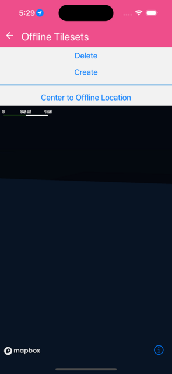

Uses offline manager tileset option to include additional tilesets in the offline pack.

To test:
- First load the example with wifi/netowork off, make sure the map is blank, and also pressing "Center Offline Location" is blank
- Close the test, enable wifi, open test again
- Disable wifi/network presss "Center Offline Location" make sure blue line which shows country contours show up


```jsx
import React from 'react';
import { Button, View, Alert } from 'react-native';
import { LinearProgress } from '@rneui/base';
import {
  MapView,
  Camera,
  ShapeSource,
  LineLayer,
  offlineManager,
  VectorSource,
} from '@rnmapbox/maps';

import { ExampleWithMetadata } from '../common/ExampleMetadata';

const packName = 'map-with-3d-terrain-pack';
const STYLE_URL = 'mapbox://styles/mapbox/satellite-streets-v11';
const DISTANCE = 0.85;
const CENTER: [number, number] = [6.58968, 45.39701];
const bounds: [number, number, number, number] = [
  CENTER[0] - DISTANCE,
  CENTER[1] - DISTANCE,
  CENTER[0] + DISTANCE,
  CENTER[1] + DISTANCE,
];

function Menu({ cameraRef }: { cameraRef: React.RefObject<Camera | null> }) {
  const [progress, setProgress] = React.useState(0);

  function formatError(err: unknown) {
    if (!err) return 'Unknown error';
    if (typeof err === 'string') return err;
    if (err instanceof Error) return err.message;
    try {
      return JSON.stringify(err, null, 2);
    } catch {
      return String(err);
    }
  }

  return (
    <View>
      <Button
        title="Delete"
        onPress={async () => {
          try {
            const pack = await offlineManager.getPack(packName);
            if (pack) {
              await offlineManager.deletePack(packName);
              setProgress(0);
            }
          } catch (error) {
            Alert.alert('Offline Error', formatError(error));
            console.error('Error deleting pack:', error);
          }
        }}
      />
      <Button
        title="Create"
        onPress={() => {
          (async () => {
            try {
              await offlineManager.createPack(
                {
                  name: packName,
                  styleURL: STYLE_URL,
                  tilesets: ['mapbox://mapbox.country-boundaries-v1'],
                  bounds: [
                    [bounds[0], bounds[1]],
                    [bounds[2], bounds[3]],
                  ] as [[number, number], [number, number]],
                  minZoom: 7,
                  maxZoom: 9,
                  metadata: {
                    whatIsThat: 'foo',
                  },
                },
                (_region, status) => {
                  setProgress(status?.percentage ?? 0);
                },
                (pack, error) => {
                  setProgress(0);
                  if (error) {
                    Alert.alert('Offline Error', formatError(error));
                  }
                  console.log('=> callback pack:', pack, 'error:', error);
                },
              );
            } catch (error) {
              Alert.alert('Offline Error', formatError(error));
              console.error('#Error creating pack:', error);
            }
          })();
        }}
      />
      <View style={{ marginVertical: 8 }}>
        <LinearProgress
          variant="determinate"
          value={progress / 100}
          color="primary"
        />
      </View>
      <Button
        title="Center to Offline Location"
        onPress={() => {
          cameraRef.current?.setCamera({
            centerCoordinate: CENTER,
            zoomLevel: 7.5,
            heading: 162,
            pitch: 0,
            animationDuration: 1000,
          });
        }}
      />
    </View>
  );
}

export default function OfflineTilesets() {
  const cameraRef = React.useRef<Camera>(null);
  return (
    <>
      <Menu cameraRef={cameraRef} />
      <MapView style={{ flex: 1 }} styleURL={STYLE_URL}>
        <Camera
          ref={cameraRef}
          defaultSettings={{
            centerCoordinate: [0, 0], //CENTER,
            zoomLevel: 12.3,
            heading: 162,
            pitch: 76,
          }}
        />
        {/* Bounds visualization */}
        <ShapeSource
          id="bounds-source"
          shape={
            {
              type: 'Feature',
              geometry: {
                type: 'LineString',
                coordinates: [
                  [bounds[0], bounds[1]],
                  [bounds[0], bounds[3]],
                  [bounds[2], bounds[3]],
                  [bounds[2], bounds[1]],
                  [bounds[0], bounds[1]],
                ],
              },
              properties: {},
            } as const
          }
        >
          <LineLayer
            id="bounds-line"
            style={{
              lineColor: '#FF0000',
              lineWidth: 3,
              lineOpacity: 0.8,
            }}
          />
        </ShapeSource>

        <VectorSource
          id="countryShapeSource"
          url="mapbox://mapbox.country-boundaries-v1"
        >
          <LineLayer
            id="countryFillLayer"
            sourceLayerID="country_boundaries" // Check the source's layer name with Mapbox Studio or the Mapbox API for the
            existing
            style={{
              lineColor: '#0000FF',
              lineWidth: 8,
              lineOpacity: 0.8,
            }}
          />
        </VectorSource>
      </MapView>
    </>
  );
}


```

}

