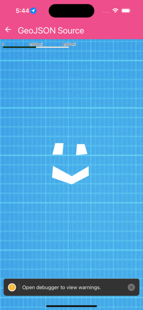

```jsx
import React from 'react';
import {
  MapView,
  Camera,
  ShapeSource,
  FillLayer,
  VectorSource,
  BackgroundLayer,
  StyleURL,
} from '@rnmapbox/maps';

import sheet from '../../styles/sheet';
import gridPattern from '../../assets/grid_pattern.png';
import smileyFaceGeoJSON from '../../assets/smiley_face.json';
import BaseExamplePropTypes from '../common/BaseExamplePropTypes';

const layerStyles = {
  background: {
    backgroundPattern: gridPattern,
  },
  smileyFace: {
    fillAntialias: true,
    fillColor: 'white',
    fillOutlineColor: 'rgba(255, 255, 255, 0.84)',
  },
};

class GeoJSONSource extends React.Component {
  static propTypes = {
    ...BaseExamplePropTypes,
  };

  render() {
    return (
      <>
        <MapView
          ref={(ref) => {
            this.map = ref;
          }}
          style={sheet.matchParent}
          styleURL={StyleURL.Dark}
        >
          <Camera zoomLevel={2} centerCoordinate={[-35.15165038, 40.6235728]} />

          <VectorSource>
            <BackgroundLayer id="background" style={layerStyles.background} />
          </VectorSource>

          <ShapeSource id="smileyFaceSource" shape={smileyFaceGeoJSON}>
            <FillLayer id="smileyFaceFill" style={layerStyles.smileyFace} />
          </ShapeSource>
        </MapView>
      </>
    );
  }
}

export default GeoJSONSource;


```

}

