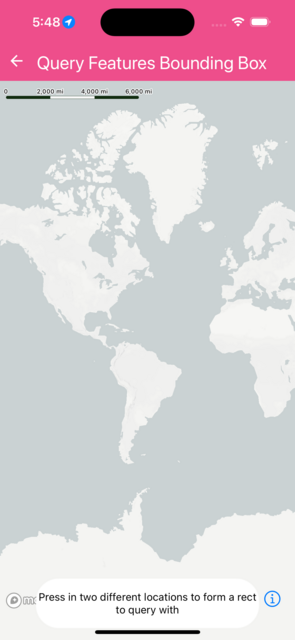

```jsx
import React from 'react';
import { Text } from 'react-native';
import MapboxGL from '@rnmapbox/maps';

import sheet from '../../styles/sheet';
import nycJSON from '../../assets/nyc_geojson.json';
import BaseExamplePropTypes from '../common/BaseExamplePropTypes';
import Bubble from '../common/Bubble';

const styles = {
  neighborhoods: {
    fillAntialias: true,
    fillColor: 'blue',
    fillOutlineColor: 'black',
    fillOpacity: 0.84,
  },
  selectedNeighborhoods: {
    fillAntialias: true,
    fillColor: 'green',
    fillOpacity: 0.84,
  },
  bubbleText: { textAlign: 'center' },
};

class QueryWithRect extends React.Component {
  static propTypes = {
    ...BaseExamplePropTypes,
  };

  constructor(props) {
    super(props);

    this.state = {
      screenCoords: [],
      selectedGeoJSON: null,
    };

    this.onPress = this.onPress.bind(this);
  }

  async onPress(e) {
    const { screenPointX, screenPointY } = e.properties;

    const screenCoords = Object.assign([], this.state.screenCoords);
    screenCoords.push([screenPointX, screenPointY]);

    if (screenCoords.length === 2) {
      const featureCollection = await this._map.queryRenderedFeaturesInRect(
        this.getBoundingBox(screenCoords),
        null,
        ['nycFill'],
      );

      this.setState({
        screenCoords: [],
        selectedGeoJSON: featureCollection.features.length
          ? featureCollection
          : null,
      });
    } else {
      this.setState({ screenCoords });
    }
  }

  getBoundingBox(screenCoords) {
    const maxX = Math.max(screenCoords[0][0], screenCoords[1][0]);
    const minX = Math.min(screenCoords[0][0], screenCoords[1][0]);
    const maxY = Math.max(screenCoords[0][1], screenCoords[1][1]);
    const minY = Math.min(screenCoords[0][1], screenCoords[1][1]);
    // Rect -> [top, right, bottom, left]
    return [minY, maxX, maxY, minX];
  }

  get message() {
    if (this.state.screenCoords.length === 1) {
      return 'Press in one more location to close the rect';
    }
    return 'Press in two different locations to form a rect to query with';
  }

  render() {
    return (
      <>
        <MapboxGL.MapView
          ref={(c) => (this._map = c)}
          onPress={this.onPress}
          style={sheet.matchParent}
          styleURL={MapboxGL.StyleURL.Light}
        >
          <MapboxGL.Camera
            zoomLevel={9}
            centerCoordinate={[-73.970895, 40.723279]}
          />

          <MapboxGL.ShapeSource id="nyc" shape={nycJSON}>
            <MapboxGL.FillLayer id="nycFill" style={styles.neighborhoods} />
          </MapboxGL.ShapeSource>

          {this.state.selectedGeoJSON ? (
            <MapboxGL.ShapeSource
              id="selectedNYC"
              shape={this.state.selectedGeoJSON}
            >
              <MapboxGL.FillLayer
                id="selectedNYCFill"
                style={styles.selectedNeighborhoods}
              />
            </MapboxGL.ShapeSource>
          ) : null}
        </MapboxGL.MapView>

        <Bubble>
          <Text style={styles.bubbleText}>{this.message}</Text>
        </Bubble>
      </>
    );
  }
}

export default QueryWithRect;


```

}

