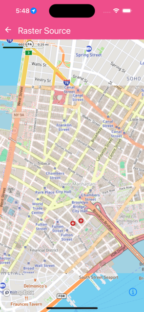

```jsx
import React from 'react';
import {
  Images,
  MapView,
  RasterLayer,
  RasterSource,
  Camera,
} from '@rnmapbox/maps';

const styles = {
  matchParent: { flex: 1 },
};

export default function RasterSourceExample() {
  return (
    <MapView style={styles.matchParent}>
      <Camera
        defaultSettings={{
          centerCoordinate: [-74.00597, 40.71427],
          zoomLevel: 14,
        }}
      />
      <RasterSource
        id="stamen-watercolor"
        tileSize={256}
        tileUrlTemplates={['https://tile.openstreetmap.org/{z}/{x}/{y}.png']}
      />
      <RasterLayer
        id="stamen-watercolor-layer"
        sourceID="stamen-watercolor"
        style={{ rasterOpacity: 0.85 }}
      />
    </MapView>
  );
}


```

}

