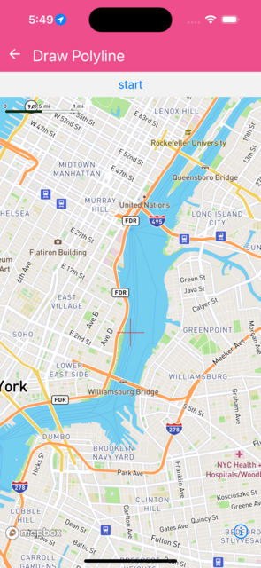

This example shows a simple polyline editor. It uses `onCameraChanged` to get the center of the map and `getCoordinateFromView`
  to get the coordinates of the crosshair.

  The crosshair is an overlay that is positioned using `onLayout` and `getCoordinateFromView`.

  The `ShapeSource` is updated with the new coordinates and the `LineLayer` is updated with the new coordinates.

```jsx
import { Camera, LineLayer, MapView, ShapeSource } from '@rnmapbox/maps';
import { Button, View } from 'react-native';
import {
  useState,
  useRef,
  ComponentProps,
  useMemo,
  forwardRef,
  type ElementRef,
} from 'react';

type Position = [number, number];

type CrosshairProps = {
  size: number;
  w: number;
  onLayout: ComponentProps<typeof View>['onLayout'];
};
const Crosshair = forwardRef<ElementRef<typeof View>, CrosshairProps>(
  ({ size, w, onLayout }: CrosshairProps, ref) => (
    <View
      onLayout={onLayout}
      ref={ref}
      style={{
        width: 2 * size + 1,
        height: 2 * size + 1,
      }}
    >
      <View
        style={{
          position: 'absolute',
          left: size,
          top: 0,
          bottom: 0,
          borderColor: 'red',
          borderWidth: w / 2.0,
        }}
      />
      <View
        style={{
          position: 'absolute',
          top: size,
          left: 0,
          right: 0,
          borderColor: 'red',
          borderWidth: w / 2.0,
        }}
      />
    </View>
  ),
);

const CrosshairOverlay = ({
  onCenter,
}: {
  onCenter: (x: [number, number]) => void;
}) => {
  const ref = useRef<ElementRef<typeof View>>(null);

  return (
    <View
      style={{
        position: 'absolute',
        top: 0,
        left: 0,
        right: 0,
        bottom: 0,
        alignContent: 'center',
        alignItems: 'center',
        justifyContent: 'center',
      }}
      pointerEvents="none"
    >
      <Crosshair
        size={20}
        w={1.0}
        ref={ref}
        onLayout={(e) => {
          const { x, y, width, height } = e.nativeEvent.layout;
          onCenter([x + width / 2.0, y + height / 2.0]);
        }}
      />
    </View>
  );
};

const lineLayerStyle = {
  lineColor: '#ff0000',
};

const Polygon = ({ coordinates }: { coordinates: Position[] }) => {
  const features: GeoJSON.FeatureCollection = useMemo(() => {
    return {
      type: 'FeatureCollection',
      features: [
        {
          type: 'Feature',
          id: 'a-feature',
          geometry: {
            type: 'LineString',
            coordinates,
          },
          properties: {},
        } as const,
      ],
    };
  }, [coordinates]);
  console.log('=> features', JSON.stringify(features));
  return (
    <ShapeSource id={'shape-source-id-0'} shape={features}>
      <LineLayer id={'line-layer'} style={lineLayerStyle} />
    </ShapeSource>
  );
};

const DrawPolyline = () => {
  const [coordinates, setCoordinates] = useState<Position[]>([]);
  const [lastCoordinate, setLastCoordinate] = useState<Position>([0, 0]);
  const [started, setStarted] = useState(false);
  const [crosshairPos, setCrosshairPos] = useState([0, 0]);

  const coordinatesWithLast = useMemo(() => {
    return [...coordinates, lastCoordinate];
  }, [coordinates, lastCoordinate]);

  const map = useRef<MapView>(null);

  const newLocal = 'row';
  return (
    <View style={{ flex: 1 }}>
      <View>
        {!started ? (
          <Button
            title="start"
            onPress={() => {
              setStarted(true);
              setCoordinates([lastCoordinate]);
            }}
          />
        ) : (
          <View
            style={{
              flexDirection: newLocal,
              justifyContent: 'center',
              gap: 10,
            }}
          >
            <Button
              title="add"
              onPress={() => setCoordinates([...coordinates, lastCoordinate])}
            />
            <Button title="stop" onPress={() => setStarted(false)} />
          </View>
        )}
      </View>
      <View style={{ flex: 1 }}>
        <MapView
          ref={map}
          style={{ flex: 1 }}
          onCameraChanged={async (e) => {
            const crosshairCoords =
              await map.current?.getCoordinateFromView(crosshairPos);
            console.log(
              'Crosshair coords: ',
              crosshairCoords,
              'camera center:',
              e.properties.center,
            );
            setLastCoordinate(crosshairCoords as Position);
            if (crosshairCoords && started) {
              setLastCoordinate(crosshairCoords as Position);
            }
          }}
        >
          {started && <Polygon coordinates={coordinatesWithLast} />}
          <Camera
            defaultSettings={{
              centerCoordinate: [-73.970895, 40.723279],
              zoomLevel: 12,
            }}
          />
        </MapView>
        <CrosshairOverlay onCenter={(c) => setCrosshairPos(c)} />
      </View>
    </View>
  );
};

export default DrawPolyline;


```

}

