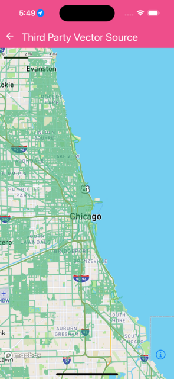

This example renders vector tiles using a third party vector tile source.

In this case, Mapillary provides the vector tiles, which are added to the map using VectorSource.

```jsx
import React from 'react';
import { MapView, Camera, VectorSource, LineLayer } from '@rnmapbox/maps';

const styles = {
  mapView: { flex: 1 },
  lineLayer: {
    lineCap: 'round',
    lineJoin: 'round',
    lineOpacity: 0.6,
    lineColor: 'rgb(53, 175, 109)',
    lineWidth: 2.0,
  },
};

const defaultCameraSettings = {
  centerCoordinate: [-87.622088, 41.878781],
  zoomLevel: 10,
};

const tileUrlTemplates = [
  'https://tiles.mapillary.com/maps/vtp/mly1_public/2/{z}/{x}/{y}?access_token=MLY|4142433049200173|72206abe5035850d6743b23a49c41333'.replaceAll(
    '|',
    '%7C',
  ),
];

function ThirdPartyVectorSource() {
  return (
    <>
      <MapView style={styles.mapView}>
        <Camera defaultSettings={defaultCameraSettings} />
        <VectorSource id="mapillary" tileUrlTemplates={tileUrlTemplates}>
          <LineLayer
            id="mapillary-lines"
            sourceLayerID="sequence"
            style={styles.lineLayer}
          />
        </VectorSource>
      </MapView>
    </>
  );
}

export default ThirdPartyVectorSource;

```

}

