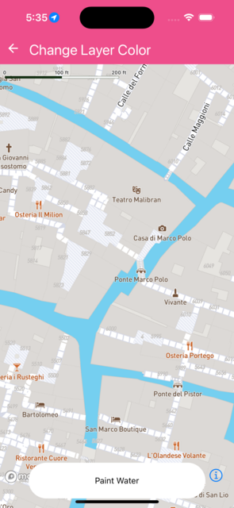

Change style of a layer part of the map on the fly.


```jsx
import React from 'react';
import { Text } from 'react-native';
import { MapView, FillLayer, Camera } from '@rnmapbox/maps';

import Bubble from '../common/Bubble';

const defaultCamera = {
  centerCoordinate: [12.338, 45.4385],
  zoomLevel: 17.4,
};

const styles = {
  mapView: { flex: 1 },
};

class ChangeLayerColor extends React.Component {
  state = {
    fillColor: '',
  };

  onPress = () => {
    const fillColor = `#${Math.random().toString(16).substr(-6)}`;
    this.setState({ fillColor });
  };

  render() {
    const { fillColor } = this.state;
    return (
      <>
        <MapView
          ref={(c) => (this._map = c)}
          onPress={this.onPress}
          style={styles.mapView}
        >
          <Camera defaultSettings={defaultCamera} />
          {!!fillColor && (
            <FillLayer id="water" existing style={{ fillColor }} />
          )}
        </MapView>
        <Bubble onPress={this.onPress}>
          <Text>Paint Water</Text>
        </Bubble>
      </>
    );
  }
}

export default ChangeLayerColor;


```

}

