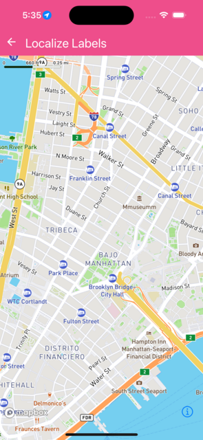

Localize labels to a specific locale(es).


```jsx
import { Camera, MapView } from '@rnmapbox/maps';

const CENTER_COORD = [-74.00597, 40.71427];

import { ExampleWithMetadata } from '../common/ExampleMetadata'; // exclude-from-doc

const LocalizeLabels = () => {
  return (
    <MapView style={{ flex: 1 }} localizeLabels={{ locale: 'es' }}>
      <Camera
        defaultSettings={{ centerCoordinate: CENTER_COORD, zoomLevel: 14 }}
      />
    </MapView>
  );
};

export default LocalizeLabels;


```

}

