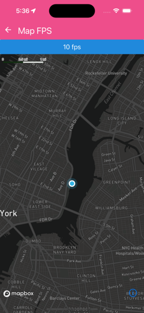

Toggles preferredFramesPerSecond between 10 fps and 60 fps, move the map around to feel the difference.

```jsx
import React, { useState, useEffect } from 'react';
import Mapbox from '@rnmapbox/maps';
import { Button } from '@rneui/base';

import sheet from '../../styles/sheet';
import { ExampleWithMetadata } from '../common/ExampleMetadata'; // exclude-from-doc

const MapFps = () => {
  const [frameRate, setFrameRate] = useState(60);

  useEffect(() => {
    Mapbox.locationManager.start();

    return (): void => {
      Mapbox.locationManager.stop();
    };
  }, []);

  return (
    <>
      <Button
        onPress={() => setFrameRate((fps) => fps === 60 ? 10 : 60)}
        title={frameRate === 60 ? '10 fps' : '60 fps'}
      />
        <Mapbox.MapView
          styleURL={Mapbox.StyleURL.Dark}
          style={sheet.matchParent}
          testID={'toggle-map-fps'}
          preferredFramesPerSecond={frameRate}
        >
          <Mapbox.Camera followZoomLevel={12} followUserLocation />

          <Mapbox.UserLocation />
        </Mapbox.MapView>
    </>
  );
};

export default MapFps;


```

}

