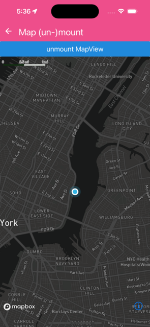

Showing and hiding the the map should not lead to increased memory consumption, use this example to check it on the profiler.


```jsx
import Mapbox from '@rnmapbox/maps';
import { useEffect, useState } from 'react';
import { Button } from 'react-native';

import sheet from '../../styles/sheet';
import { ExampleWithMetadata } from '../common/ExampleMetadata'; // exclude-from-doc

const MapUnMount = () => {
  const [isMounted, setIsMounted] = useState(true);

  useEffect(() => {
    Mapbox.locationManager.start();

    return (): void => {
      Mapbox.locationManager.stop();
    };
  }, []);

  return (
    <>
      <Button
        onPress={() => setIsMounted((mounted) => !mounted)}
        title={isMounted ? 'unmount MapView' : 'mount MapView'}
      />
      {isMounted ? (
        <Mapbox.MapView
          styleURL={Mapbox.StyleURL.Dark}
          style={sheet.matchParent}
          testID={'show-map'}
        >
          <Mapbox.Camera followZoomLevel={12} followUserLocation />

          <Mapbox.UserLocation />
        </Mapbox.MapView>
      ) : null}
    </>
  );
};

export default MapUnMount;


```

}

