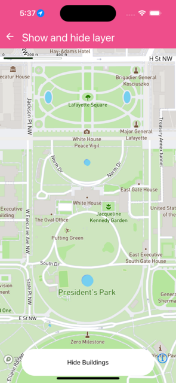

Changes visibility of layers part of the map


```jsx
import React from 'react';
import { Text } from 'react-native';
import { MapView, Camera, FillLayer, LineLayer } from '@rnmapbox/maps';

import Bubble from '../common/Bubble';

const defaultCamera = {
  centerCoordinate: [-77.036532, 38.897318],
  zoomLevel: 16,
};

const styles = {
  mapView: { flex: 1 },
};

class ShowAndHideLayer extends React.Component {
  state = {
    show: true,
  };

  onPress = () => {
    this.setState({
      show: !this.state.show,
    });
  };

  render() {
    const visibility = this.state.show ? 'visible' : 'none';
    return (
      <>
        <MapView
          ref={(c) => {
            this._map = c;
          }}
          onPress={this.onPress}
          style={styles.mapView}
        >
          <Camera defaultSettings={defaultCamera} />
          <FillLayer id="building" existing style={{ visibility }} />
          <LineLayer id="building-outline" existing style={{ visibility }} />
        </MapView>
        <Bubble onPress={this.onPress}>
          <Text>{this.state.show ? 'Hide Buildings' : 'Show Buildings'}</Text>
        </Bubble>
      </>
    );
  }
}

export default ShowAndHideLayer;


```

}

