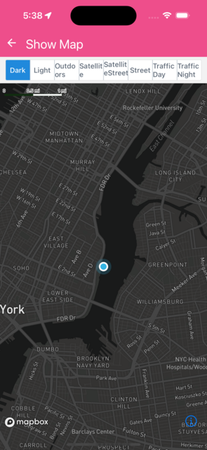

Shows a map with the user location annotation enabled, and on press of the user location annotation, an alert is shown.


```jsx
import { useEffect, useState } from 'react';
import { Alert } from 'react-native';
import Mapbox from '@rnmapbox/maps';
import { ButtonGroup } from '@rneui/base';

import sheet from '../../styles/sheet';
import { onSortOptions } from '../../utils';
import { ExampleWithMetadata } from '../common/ExampleMetadata'; // exclude-from-doc

const ShowMap = () => {
  const _mapOptions = Object.keys(Mapbox.StyleURL)
    .map((key) => {
      return {
        label: key,
        data: (Mapbox.StyleURL as any)[key], // bad any, because enums
      };
    })
    .sort(onSortOptions);

  const [styleURL, setStyleURL] = useState({ styleURL: _mapOptions[0]!.data });

  useEffect(() => {
    Mapbox.locationManager.start();

    return (): void => {
      Mapbox.locationManager.stop();
    };
  }, []);

  const onMapChange = (_index: number, newStyleURL: Mapbox.StyleURL): void => {
    setStyleURL({ styleURL: newStyleURL });
  };

  const onUserMarkerPress = (): void => {
    Alert.alert('You pressed on the user location annotation');
  };

  return (
    <>
      <ButtonGroup
        buttons={_mapOptions.map((i) => i.label)}
        selectedIndex={_mapOptions.findIndex(
          (i) => i.data === styleURL.styleURL,
        )}
        onPress={(index) => onMapChange(index, _mapOptions[index]!.data)}
      />
      <Mapbox.MapView
        styleURL={styleURL.styleURL}
        style={sheet.matchParent}
        testID={'show-map'}
      >
        <Mapbox.Camera followZoomLevel={12} followUserLocation />

        <Mapbox.UserLocation onPress={onUserMarkerPress} />
      </Mapbox.MapView>
    </>
  );
};

export default ShowMap;


```

}

