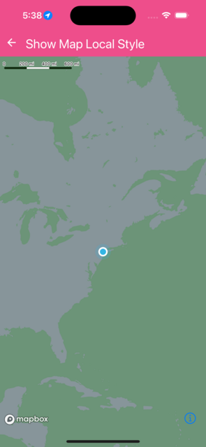

Customize ornaments of the map(logo, compass, scalebar, attribution)


```jsx
import React, { useEffect } from 'react';
import { Alert } from 'react-native';
import Mapbox from '@rnmapbox/maps';

import sheet from '../../styles/sheet';
import { ExampleWithMetadata } from '../common/ExampleMetadata'; // exclude-from-doc

// eslint-disable-next-line @typescript-eslint/no-var-requires
const style = JSON.stringify(require('../../assets/map-styleURL-style.json'));

const ShowMap = () => {
  useEffect(() => {
    Mapbox.locationManager.start();

    return (): void => {
      Mapbox.locationManager.stop();
    };
  }, []);

  const onUserMarkerPress = (): void => {
    Alert.alert('You pressed on the user location annotation');
  };

  return (
    <Mapbox.MapView styleURL={style} style={sheet.matchParent}>
      <Mapbox.Camera followZoomLevel={3} followUserLocation />

      <Mapbox.UserLocation onPress={onUserMarkerPress} />
    </Mapbox.MapView>
  );
};

export default ShowMap;


```

}

