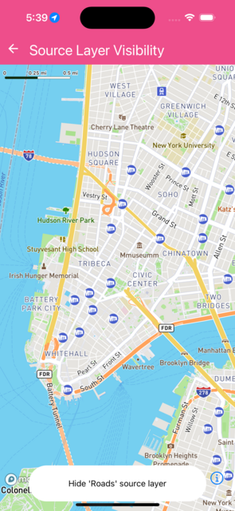

Changes visibility of layers using a source in the map


```jsx
import React from 'react';
import { Text } from 'react-native';
import { MapView, Camera } from '@rnmapbox/maps';

import Bubble from '../common/Bubble';

const defaultCamera = {
  centerCoordinate: [-74.005974, 40.712776],
  zoomLevel: 13,
};

const styles = {
  mapView: { flex: 1 },
};

class SourceLayerVisibility extends React.Component {
  state = {
    show: true,
  };

  onPress = () => {
    this.setState(
      {
        show: !this.state.show,
      },
      () => {
        this._map.setSourceVisibility(this.state.show, 'composite', 'road');
      },
    );
  };

  render() {
    return (
      <>
        <MapView
          ref={(c) => {
            this._map = c;
          }}
          onPress={this.onPress}
          style={styles.mapView}
        >
          <Camera defaultSettings={defaultCamera} />
        </MapView>
        <Bubble onPress={this.onPress}>
          <Text>{`${
            this.state.show ? 'Hide' : 'Show'
          } 'Roads' source layer`}</Text>
        </Bubble>
      </>
    );
  }
}

export default SourceLayerVisibility;


```

}

