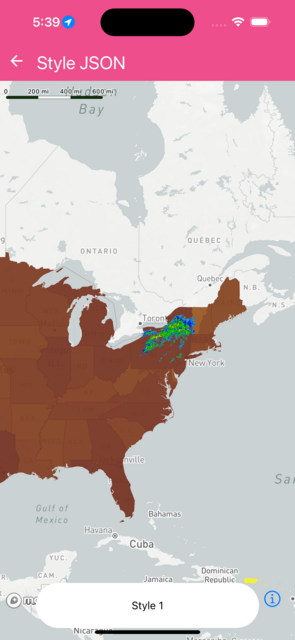

Change style of a MapView on the fly.


```jsx
import React from 'react';
import { Text, StyleSheet } from 'react-native';
import { MapView, Camera, Style, StyleURL } from '@rnmapbox/maps';

import StyleJsonExample from '../../assets/style-json-example.json';
import StyleJsonExample2 from '../../assets/style-json-example2.json';
import Bubble from '../common/Bubble';

const styles = StyleSheet.create({
  map: {
    flex: 1,
  },
});

const defaultCamera = {
  centerCoordinate: [-78.54382, 40.446947],
  zoomLevel: 3,
  minZoomLevel: 3,
};

class StyleJson extends React.Component {
  state = {
    showAltStyle: false,
  };

  onPress = () => {
    this.setState({
      showAltStyle: !this.state.showAltStyle,
    });
  };

  render() {
    return (
      <>
        <MapView styleURL={StyleURL.Light} style={styles.map}>
          <Camera defaultSettings={defaultCamera} />
          <Style
            json={
              this.state.showAltStyle ? StyleJsonExample2 : StyleJsonExample
            }
          />
        </MapView>
        <Bubble onPress={this.onPress}>
          <Text>{this.state.showAltStyle ? 'Style 2' : 'Style 1'}</Text>
        </Bubble>
      </>
    );
  }
}

export default StyleJson;


```

}

