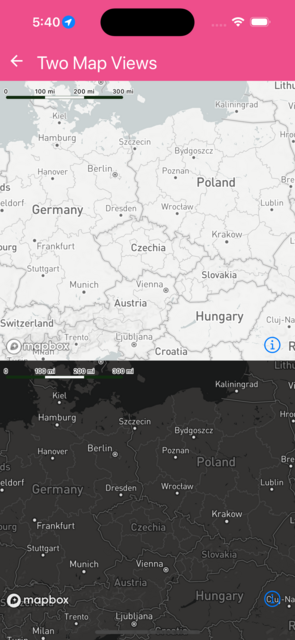

Display two map views side by side


```jsx
import React from 'react';
import { MapView, ShapeSource, FillLayer, StyleURL } from '@rnmapbox/maps';

import sheet from '../../styles/sheet';
import smileyFaceGeoJSON from '../../assets/smiley_face.json';

const layerStyles = {
  smileyFaceLight: {
    fillAntialias: true,
    fillColor: 'white',
    fillOutlineColor: 'rgba(255, 255, 255, 0.84)',
  },
  smileyFaceDark: {
    fillAntialias: true,
    fillColor: 'black',
    fillOutlineColor: 'rgba(0, 0, 0, 0.84)',
  },
};

class TwoByTwo extends React.Component {
  renderMap(styleURL, layerStyle) {
    return (
      <MapView
        zoomLevel={2}
        centerCoordinate={[-35.15165038, 40.6235728]}
        onSetCameraComplete={this.onUpdateZoomLevel}
        ref={(ref) => {
          this.map = ref;
        }}
        style={sheet.matchParent}
        styleURL={styleURL}
      >
        <ShapeSource id="smileyFaceSource" shape={smileyFaceGeoJSON}>
          <FillLayer id="smileyFaceFill" style={layerStyle} />
        </ShapeSource>
      </MapView>
    );
  }

  render() {
    return (
      <>
        {this.renderMap(StyleURL.Light, layerStyles.smileyFaceDark)}
        {this.renderMap(StyleURL.Dark, layerStyles.smileyFaceLight)}
      </>
    );
  }
}

export default TwoByTwo;

/** @type ExampleWithMetadata['metadata'] */
const metadata = {
  title: 'Two Map Views',
  tags: ['MapView'],
  docs: `
Display two map views side by side
`,
};
TwoByTwo.metadata = metadata;

```

}

