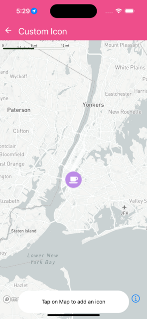

Renders a symbol layer with custom icon defined using the Images component. Clicking a location on a map add a new icon.


```jsx
import { useRef, memo, useState } from 'react';
import { Text } from 'react-native';
import {
  MapView,
  Camera,
  ShapeSource,
  SymbolLayer,
  Images,
  StyleURL,
} from '@rnmapbox/maps';
// @ts-ignore - @turf packages have type resolution issues with package.json exports
import { featureCollection, feature, point } from '@turf/helpers';

import Bubble from '../common/Bubble';
import type { ExampleWithMetadata } from '../common/ExampleMetadata';
import exampleIcon from '../../assets/example.png';

const styles = {
  icon: {
    iconImage: 'icon',
    iconAllowOverlap: true,
  },
};

const CustomIcon = memo(() => {
  const cameraRef = useRef<Camera>(null);
  const [stateFeatureCollection, setStateFeatureCollection] =
    useState<GeoJSON.FeatureCollection>(
      featureCollection([point([-73.970895, 40.723279])]),
    );

  const onPress = (e: GeoJSON.Feature) => {
    const aFeature = feature(e.geometry);
    aFeature.id = `${Date.now()}`;

    setStateFeatureCollection(
      featureCollection([...stateFeatureCollection.features, aFeature]),
    );
  };

  const onSourceLayerPress = (e: any) => {
    console.log(
      'You pressed a layer here are your features:',
      e.features,
      e.coordinates,
      e.point,
    );
  };

  return (
    <>
      <MapView style={{ flex: 1 }} styleURL={StyleURL.Light} onPress={onPress}>
        <Camera
          ref={cameraRef}
          defaultSettings={{
            zoomLevel: 9,
            centerCoordinate: [-73.970895, 40.723279],
          }}
        />
        <ShapeSource
          id="symbolLocationSource"
          hitbox={{ width: 20, height: 20 }}
          onPress={(e) => onSourceLayerPress(e)}
          shape={stateFeatureCollection}
        >
          <SymbolLayer
            id="symbolLocationSymbols"
            minZoomLevel={1}
            style={styles.icon}
          />
          <Images images={{ icon: exampleIcon }} />
        </ShapeSource>
      </MapView>
      <Bubble>
        <Text>Tap on Map to add an icon</Text>
      </Bubble>
    </>
  );
});

export default CustomIcon;

```

}

