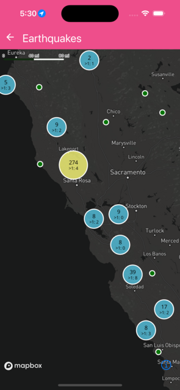

Renders earthqueke with clustering.

Click a cluster to show list of contents in the cluster `getClusterLeaves`.


```jsx
import MapboxGL, {
  Camera,
  CircleLayer,
  CircleLayerStyle,
  MapView,
  ShapeSource,
  SymbolLayer,
  SymbolLayerStyle,
} from '@rnmapbox/maps';
import { FeatureCollection } from 'geojson';
import React, { useRef, useState } from 'react';
import { FAB, Icon, ListItem } from '@rneui/base';
import moment from 'moment';
import { FlatList, Modal } from 'react-native';
import { SafeAreaView } from 'react-native-safe-area-context';

import earthQuakesJSON from '../../assets/earthquakes.json';
import { SF_OFFICE_COORDINATE } from '../../utils';
import { ExampleWithMetadata } from '../common/ExampleMetadata';
import { BaseExampleProps } from '../common/BaseExamplePropTypes';

const layerStyles: {
  singlePoint: CircleLayerStyle;
  clusteredPoints: CircleLayerStyle;
  clusterCount: SymbolLayerStyle;
} = {
  singlePoint: {
    circleColor: 'green',
    circleOpacity: 0.84,
    circleStrokeWidth: 2,
    circleStrokeColor: 'white',
    circleRadius: 5,
    circlePitchAlignment: 'map',
  },

  clusteredPoints: {
    circlePitchAlignment: 'map',

    circleColor: [
      'step',
      ['get', 'point_count'],
      '#51bbd6',
      100,
      '#f1f075',
      750,
      '#f28cb1',
    ],

    circleRadius: ['step', ['get', 'point_count'], 20, 100, 30, 750, 40],

    circleOpacity: 0.84,
    circleStrokeWidth: 2,
    circleStrokeColor: 'white',
  },

  clusterCount: {
    textField: [
      'format',
      ['concat', ['get', 'point_count'], '\n'],
      {},
      [
        'concat',
        '>1: ',
        [
          '+',
          ['get', 'mag2'],
          ['get', 'mag3'],
          ['get', 'mag4'],
          ['get', 'mag5'],
        ],
      ],
      { 'font-scale': 0.8 },
    ],
    textSize: 12,
    textPitchAlignment: 'map',
  },
};

const styles = {
  matchParent: {
    flex: 1,
  },
} as const;

const mag1 = ['<', ['get', 'mag'], 2];
const mag2 = ['all', ['>=', ['get', 'mag'], 2], ['<', ['get', 'mag'], 3]];
const mag3 = ['all', ['>=', ['get', 'mag'], 3], ['<', ['get', 'mag'], 4]];
const mag4 = ['all', ['>=', ['get', 'mag'], 4], ['<', ['get', 'mag'], 5]];
const mag5 = ['>=', ['get', 'mag'], 5];

const modalStyles = {
  fab: {
    position: 'absolute',
    top: 10,
    right: 10,
    elevation: 9999,
    zIndex: 9999,
  },
} as const;

export const EarthquakesDetailsModal: React.FC<{
  selectedCluster?: FeatureCollection;
  dismiss: () => void;
}> = ({ selectedCluster, dismiss }) => (
  <SafeAreaView style={{ flex: 1 }}>
    <FAB
      onPress={dismiss}
      icon={<Icon name="close" />}
      size="large"
      style={modalStyles.fab}
    />
    {selectedCluster && (
      <FlatList
        style={{ flex: 1 }}
        keyExtractor={({ properties: earthquakeInfo }) => {
          return earthquakeInfo?.code;
        }}
        data={selectedCluster.features}
        renderItem={({ item: { properties: earthquakeInfo } }) => {
          const magnitude = `Magnitude: ${earthquakeInfo?.mag}`;
          const place = `Place: ${earthquakeInfo?.place}`;
          const code = `Code: ${earthquakeInfo?.code}`;
          const time = `Time: ${moment(earthquakeInfo?.time).format(
            'MMMM Do YYYY, h:mm:ss a',
          )}`;

          return (
            <ListItem bottomDivider key={code}>
              <ListItem.Content>
                <ListItem.Title>{earthquakeInfo?.title}</ListItem.Title>
                <ListItem.Subtitle>{magnitude}</ListItem.Subtitle>
                <ListItem.Subtitle>{place}</ListItem.Subtitle>
                <ListItem.Subtitle>{code}</ListItem.Subtitle>
                <ListItem.Subtitle>{time}</ListItem.Subtitle>
              </ListItem.Content>
            </ListItem>
          );
        }}
      />
    )}
  </SafeAreaView>
);

const Earthquakes: React.FC<Partial<BaseExampleProps>> = () => {
  const shapeSource = useRef<ShapeSource>(null);
  const [selectedCluster, setSelectedCluster] = useState<FeatureCollection>();

  return (
    <>
      <MapView style={styles.matchParent} styleURL={MapboxGL.StyleURL.Dark}>
        <Camera
          defaultSettings={{
            centerCoordinate: SF_OFFICE_COORDINATE,
            zoomLevel: 6,
          }}
        />
        <ShapeSource
          id="earthquakes"
          onPress={async pressedShape => {
            if (shapeSource.current) {
              try {
                const [cluster] = pressedShape.features;

                const collection = await shapeSource.current.getClusterLeaves(
                  cluster,
                  999,
                  0,
                );

                setSelectedCluster(collection);
              } catch {
                if (!pressedShape.features[0].properties?.cluster) {
                  setSelectedCluster({
                    type: 'FeatureCollection',
                    features: [pressedShape.features[0]],
                  });
                }
              }
            }
          }}
          ref={shapeSource}
          cluster
          clusterRadius={50}
          clusterMaxZoomLevel={14}
          clusterProperties={{
            mag1: [
              ['+', ['accumulated'], ['get', 'mag1']],
              ['case', mag1, 1, 0],
            ],
            mag2: [
              ['+', ['accumulated'], ['get', 'mag2']],
              ['case', mag2, 1, 0],
            ],
            mag3: [
              ['+', ['accumulated'], ['get', 'mag3']],
              ['case', mag3, 1, 0],
            ],
            mag4: [
              ['+', ['accumulated'], ['get', 'mag4']],
              ['case', mag4, 1, 0],
            ],
            mag5: [
              ['+', ['accumulated'], ['get', 'mag5']],
              ['case', mag5, 1, 0],
            ],
          }}
          shape={earthQuakesJSON as unknown as FeatureCollection}
        >
          <SymbolLayer id="pointCount" style={layerStyles.clusterCount} />

          <CircleLayer
            id="clusteredPoints"
            belowLayerID="pointCount"
            filter={['has', 'point_count']}
            style={layerStyles.clusteredPoints}
          />

          <CircleLayer
            id="singlePoint"
            filter={['!', ['has', 'point_count']]}
            style={layerStyles.singlePoint}
          />
        </ShapeSource>
      </MapView>
      <Modal
        visible={!!selectedCluster}
        animationType="slide"
        presentationStyle="formSheet"
        onRequestClose={() => setSelectedCluster(undefined)}
      >
        <EarthquakesDetailsModal
          selectedCluster={selectedCluster}
          dismiss={() => setSelectedCluster(undefined)}
        />
      </Modal>
    </>
  );
};

export default Earthquakes;


```

}

