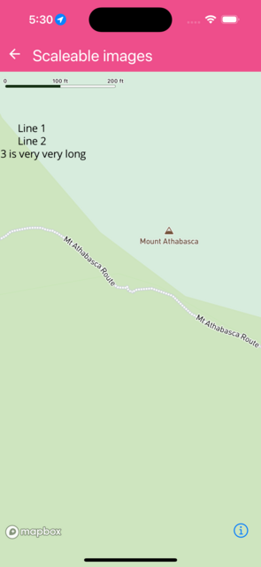

Demonstates Scalable images.

You can use strachX, stretchY and content to scale a bitmap image - keep parts of it fixed while only scale specific parts.


```jsx
import React from 'react';
import Mapbox, { type ImageEntry } from '@rnmapbox/maps';

import type { ExampleWithMetadata } from '../common/ExampleMetadata';

const styles = {
  icon: {
    iconImage: ['get', 'icon'],
    iconColor: ['get', 'color'],
    textField: ['get', 'name'],
    iconTextFit: 'both',
  },
  matchParent: { flex: 1 },
} as const;

const featureCollection: GeoJSON.FeatureCollection = {
  type: 'FeatureCollection',
  features: [
    {
      type: 'Feature',
      id: '9d10456e-bdda-4aa9-9269-04c1667d4552',
      properties: {
        icon: 'popup',
        color: '#0fc',
        name: 'Line 1\nLine 2\nLine 3 is very very long',
      },
      geometry: {
        type: 'Point',
        coordinates: [-117.206908, 52.181843],
      },
    },
  ],
};

class ScaleableImages extends React.PureComponent {
  state: {
    images: { [key: string]: ImageEntry };
  } = {
    images: {
      popup: {
        url: 'https://docs.mapbox.com/mapbox-gl-js/assets/popup_debug.png',
        stretchX: [
          [25, 55],
          [85, 105],
        ],
        stretchY: [[25, 100]],
        content: [25, 25, 115, 100],
        scale: 1.0,
      },
    },
  };

  render() {
    const { images } = this.state;

    return (
      <Mapbox.MapView style={styles.matchParent}>
        <Mapbox.Camera
          defaultSettings={{
            zoomLevel: 17,
            centerCoordinate: [-117.20611157485, 52.180961084261],
          }}
        />
        <Mapbox.Images
          images={images}
          onImageMissing={(imageKey: string) =>
            console.log('=> on image missing', imageKey)
          }
        />
        <Mapbox.ShapeSource id="exampleShapeSource" shape={featureCollection}>
          <Mapbox.SymbolLayer id="exampleIconName" style={styles.icon} />
        </Mapbox.ShapeSource>
      </Mapbox.MapView>
    );
  }
}

export default ScaleableImages;


```

}

