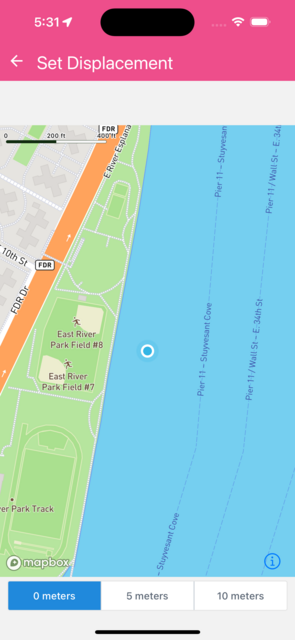

Change the minimum displacement required to update the user location.


```jsx
import React from 'react';
import Mapbox, { MapView, UserLocation, Camera } from '@rnmapbox/maps';
import { SafeAreaView } from 'react-native-safe-area-context';
import { ButtonGroup } from '@rneui/base';

const DISPLACEMENT = [0, 5, 10];

const styles = { matchParent: { flex: 1 } };

class SetDisplacement extends React.Component {
  state = { minDisplacement: DISPLACEMENT[0] };

  componentDidMount() {
    Mapbox.locationManager.start();
  }

  componentWillUnmount() {
    Mapbox.locationManager.stop();
  }

  onDisplacementChange = (index) => {
    this.setState({ minDisplacement: DISPLACEMENT[index] });
  };

  render() {
    return (
      <SafeAreaView style={styles.matchParent}>
        <MapView style={styles.matchParent}>
          <Camera
            followZoomLevel={16}
            followUserMode="compass"
            followUserLocation
          />

          <UserLocation minDisplacement={this.state.minDisplacement} />
        </MapView>
        <ButtonGroup
          buttons={DISPLACEMENT.map((i) => `${i} meters`)}
          selectedIndex={DISPLACEMENT.indexOf(this.state.minDisplacement)}
          onPress={this.onDisplacementChange}
        />
      </SafeAreaView>
    );
  }
}

export default SetDisplacement;


```

}

