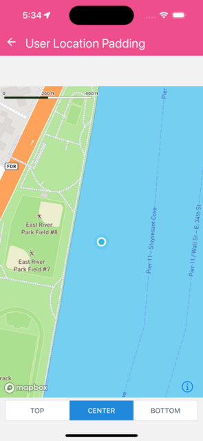

Demonstates Scalable images.

You can use strachX, stretchY and content to scale a bitmap image - keep parts of it fixed while only scale specific parts.


```jsx
import { useState } from 'react';
import {
  MapView,
  Camera,
  UserLocation,
  type CameraPadding,
} from '@rnmapbox/maps';
import { ButtonGroup } from '@rneui/base';
import { SafeAreaView } from 'react-native-safe-area-context';

import { ExampleWithMetadata } from '../common/ExampleMetadata'; // exclude-from-example-doc

enum Alignment {
  Top = 'TOP',
  Center = 'CENTER',
  Bottom = 'BOTTOM',
}

const ALIGNMENTS: Record<Alignment, Partial<CameraPadding>> = {
  [Alignment.Top]: { paddingBottom: 300 },
  [Alignment.Center]: {},
  [Alignment.Bottom]: { paddingTop: 300 },
};

const styles = { matchParent: { flex: 1 } };

const UserLocationPadding = () => {
  const [alignment, setAlignment] = useState<Alignment>(Alignment.Center);

  return (
    <SafeAreaView style={styles.matchParent}>
      <MapView style={styles.matchParent}>
        <Camera followUserLocation followPadding={ALIGNMENTS[alignment]} />
        <UserLocation />
      </MapView>
      <ButtonGroup
        buttons={Object.values(Alignment)}
        selectedIndex={Object.values(Alignment).indexOf(alignment)}
        onPress={(index) => setAlignment(Object.values(Alignment)[index]!)}
      />
    </SafeAreaView>
  );
};

export default UserLocationPadding;


```

}

