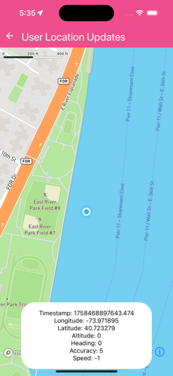

Retrieves and shows location updates from UserLocation componen via the `onUpdate` callback


```jsx
import React, { useState } from 'react';
import { Text } from 'react-native';
import MapboxGL, { Location } from '@rnmapbox/maps';

import Bubble from '../common/Bubble';
import { ExampleWithMetadata } from '../common/ExampleMetadata'; // exclude-from-example-doc

const UserLocationUpdates = () => {
  const [location, setLocation] = useState<Location>();

  return (
    <>
      <MapboxGL.MapView style={styles.matchParent}>
        <MapboxGL.UserLocation
          onUpdate={(newLocation) => setLocation(newLocation)}
        />
        <MapboxGL.Camera followUserLocation followZoomLevel={16} />
      </MapboxGL.MapView>

      <Bubble>
        {location && (
          <>
            <Text>Timestamp: {location.timestamp}</Text>
            <Text>Longitude: {location.coords.longitude}</Text>
            <Text>Latitude: {location.coords.latitude}</Text>
            <Text>Altitude: {location.coords.altitude}</Text>
            <Text>Heading: {location.coords.heading}</Text>
            <Text>Accuracy: {location.coords.accuracy}</Text>
            <Text>Speed: {location.coords.speed}</Text>
          </>
        )}
      </Bubble>
    </>
  );
};

const styles = {
  matchParent: {
    flex: 1,
  },
};

export default UserLocationUpdates;

```

}

