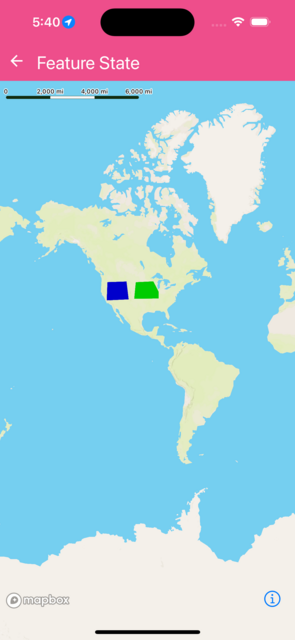

Demonstrates modifying the feature state.


```jsx
import React, { ComponentProps, useCallback, useRef } from 'react';
import { Camera, FillLayer, MapView, ShapeSource } from '@rnmapbox/maps';

import { ExampleWithMetadata } from '../common/ExampleMetadata';

type CustomProperties = {
  normalColor: string;
  selectedColor: string;
};

const SOURCE: GeoJSON.FeatureCollection<GeoJSON.Polygon, CustomProperties> = {
  type: 'FeatureCollection',
  features: [
    {
      type: 'Feature',
      id: 1,
      properties: { normalColor: '#0000cc', selectedColor: '#ff0000' },
      geometry: {
        type: 'Polygon',
        coordinates: [
          [
            [-107.8857421875, 45.197522303056815],
            [-106.5234375, 36.58024660149866],
            [-120.498046875, 36.10237644873645],
            [-120.05859375, 44.918139299585135],
            [-107.8857421875, 45.197522303056815],
          ],
        ],
      },
    },
    {
      type: 'Feature',
      id: 2,
      properties: { normalColor: '#00cc00', selectedColor: '#ff00ff' },
      geometry: {
        type: 'Polygon',
        coordinates: [
          [
            [-90.59326171875, 45.25942203635168],
            [-87.1875, 40.46366632458768],
            [-87.1875, 37.07271048132945],
            [-102.81005859375, 36.89719446989035],
            [-101.77734375, 44.8714427501659],
            [-90.59326171875, 45.25942203635168],
          ],
        ],
      },
    },
  ],
};

const SHAPES_SOURCE_ID = 'shapes';
const SELECTED_KEY = 'selected';

const styles = {
  map: {
    flex: 1,
  },
  shapesFill: {
    fillColor: [
      'case',
      ['to-boolean', ['feature-state', SELECTED_KEY]],
      ['get', 'selectedColor'],
      ['get', 'normalColor'],
    ],
  },
} as const;

type ShapeSourceProps = ComponentProps<typeof ShapeSource>;

const FeatureState = () => {
  const mapRef = useRef<MapView>(null);

  const toggleSelected = useCallback(async (featureId: string) => {
    const { current: map } = mapRef;
    if (!map) return;

    console.log(`Toggling selected state for ID '${featureId}'`);

    try {
      const currentState = await map.getFeatureState(
        featureId,
        SHAPES_SOURCE_ID,
      );

      console.log(`Current state: ${JSON.stringify(currentState)}`);

      if ('selected' in currentState) {
        await map.removeFeatureState(featureId, SELECTED_KEY, SHAPES_SOURCE_ID);
      } else {
        await map.setFeatureState(
          featureId,
          {
            [SELECTED_KEY]: true,
          },
          SHAPES_SOURCE_ID,
        );
      }
    } catch (err) {
      console.error(
        `Failed to toggle feature state for ID '${featureId}': ${
          (err as Error).message
        }`,
      );
    }
  }, []);

  const handlePressShapes: NonNullable<ShapeSourceProps['onPress']> =
    useCallback(
      (e) => {
        const [feature] = e.features;
        if (!feature || feature.id === undefined) return;
        toggleSelected(feature.id.toString());
      },
      [toggleSelected],
    );

  return (
    <MapView ref={mapRef} style={styles.map}>
      <Camera zoomLevel={2} centerCoordinate={[-101.051593, 41.370337]} />
      <ShapeSource
        id={SHAPES_SOURCE_ID}
        shape={SOURCE}
        onPress={handlePressShapes}
      >
        <FillLayer id="shapesFill" style={styles.shapesFill} />
      </ShapeSource>
    </MapView>
  );
};

export default FeatureState;

const metadata: ExampleWithMetadata['metadata'] = {
  title: 'Feature State',
  tags: [
    'MapView',
    'MapView#setFeatureState',
    'MapView#getFeatureState',
    'MapView#removeFeatureState',
  ],
  docs: `
Demonstrates modifying the feature state.
`,
};

FeatureState.metadata = metadata;

```

}

