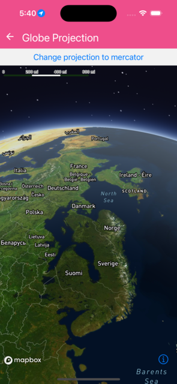

Shows map with globe projection


```jsx
import React, { memo, useState } from 'react';
import { Button } from 'react-native';
import {
  MapView,
  SkyLayer,
  Logger,
  Terrain,
  RasterDemSource,
  Atmosphere,
  Camera,
} from '@rnmapbox/maps';

import { ExampleWithMetadata } from '../common/ExampleMetadata'; // exclude-from-doc

Logger.setLogLevel('verbose');

const GlobeProjection = () => {
  const [projection, setProjection] = useState<'globe' | 'mercator'>('globe');

  return (
    <>
      <Button
        title={`Change projection to ${
          projection === 'globe' ? 'mercator' : 'globe'
        }`}
        onPress={() =>
          setProjection(projection === 'globe' ? 'mercator' : 'globe')
        }
      />
      <MapView
        style={{ flex: 1 }}
        projection={projection}
        styleURL={'mapbox://styles/mapbox-map-design/ckhqrf2tz0dt119ny6azh975y'}
      >
        <Camera
          defaultSettings={{
            centerCoordinate: [13, 59],
            zoomLevel: 3,
            heading: 220,
            pitch: 40,
          }}
        />
        <RasterDemSource
          id="mapbox-dem"
          url="mapbox://mapbox.mapbox-terrain-dem-v1"
          tileSize={514}
          maxZoomLevel={14}
        >
          <Atmosphere
            style={{
              color: 'rgb(186, 210, 235)',
              highColor: 'rgb(36, 92, 223)',
              horizonBlend: 0.02,
              spaceColor: 'rgb(11, 11, 25)',
              starIntensity: 0.6,
            }}
          />
          <SkyLayer
            id="sky-layer"
            style={{
              skyType: 'atmosphere',
              skyAtmosphereSun: [0.0, 0.0],
              skyAtmosphereSunIntensity: 15.0,
            }}
          />
          <Terrain style={{ exaggeration: 1.5 }} />
        </RasterDemSource>
      </MapView>
    </>
  );
};

export default GlobeProjection;


```

}

