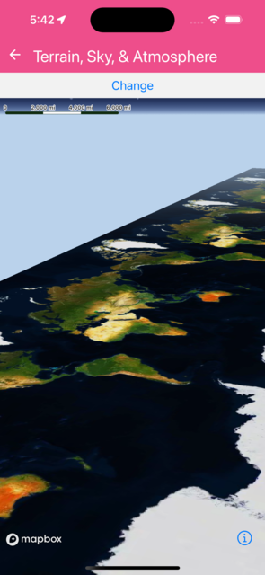

Demonstrates use of Terrain, Atmosphere and SkyLayer. Use the Snow/Rain buttons to toggle experimental particle weather effects.


```jsx
import { useRef, useState } from 'react';
import { Button, StyleSheet, View } from 'react-native';
import {
  MapView,
  SkyLayer,
  Logger,
  Terrain,
  RasterDemSource,
  Atmosphere,
  Snow,
  Rain,
  Camera,
} from '@rnmapbox/maps';

Logger.setLogLevel('verbose');

type WeatherEffect = 'none' | 'snow' | 'rain';

const TerrainSkyAtmosphere = () => {
  const cameraRef = useRef<Camera>(null);
  const [weather, setWeather] = useState<WeatherEffect>('none');

  return (
    <View style={styles.container}>
      <View style={styles.buttons}>
        <Button
          title="Fly"
          onPress={() =>
            cameraRef.current?.setCamera({
              heading: 60,
              zoomLevel: 13.5,
              animationDuration: 20000,
            })
          }
        />
        <Button title="Snow" onPress={() => setWeather('snow')} />
        <Button title="Rain" onPress={() => setWeather('rain')} />
        <Button title="Clear" onPress={() => setWeather('none')} />
      </View>
      <MapView
        style={styles.map}
        styleURL={'mapbox://styles/mapbox/standard'}
      >
        <Camera
          ref={cameraRef}
          defaultSettings={{
            centerCoordinate: [-114.34411, 32.6141],
            zoomLevel: 13.1,
            heading: 80,
            pitch: 85,
          }}
        />
        <RasterDemSource
          id="mapbox-dem"
          url="mapbox://mapbox.mapbox-terrain-dem-v1"
          tileSize={514}
          maxZoomLevel={14}
        >
          <Atmosphere
            style={{
              color: 'rgb(186, 210, 235)',
              highColor: 'rgb(36, 92, 223)',
              horizonBlend: 0.02,
              spaceColor: 'rgb(11, 11, 25)',
              starIntensity: 0.6,
            }}
          />
          <SkyLayer
            id="sky-layer"
            style={{
              skyType: 'atmosphere',
              skyAtmosphereSun: [0.0, 0.0],
              skyAtmosphereSunIntensity: 15.0,
            }}
          />
          <Terrain style={{ exaggeration: 1.5 }} />
        </RasterDemSource>
        {weather === 'snow' && (
          <Snow style={{ density: 0.85, intensity: 0.8, color: '#ffffff', opacity: 1.0 }} />
        )}
        {weather === 'rain' && (
          <Rain style={{ density: 0.5, intensity: 0.8, opacity: 0.88 }} />
        )}
      </MapView>
    </View>
  );
};

const styles = StyleSheet.create({
  container: { flex: 1 },
  map: { flex: 1 },
  buttons: {
    flexDirection: 'row',
    justifyContent: 'space-around',
    padding: 8,
  },
});

export default TerrainSkyAtmosphere;


```

}

